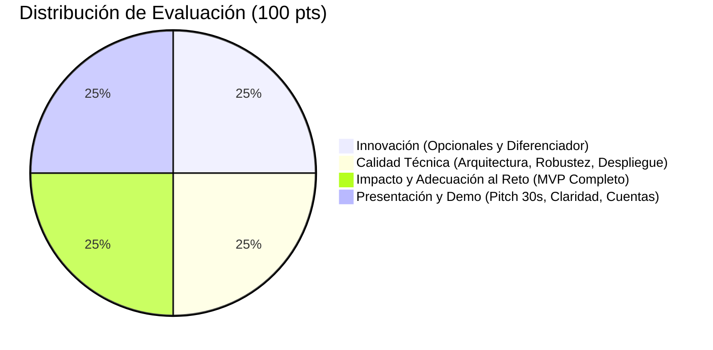

# Contexto del Proyecto: Sistema de Registro y Coordinación de Centros de Acopio (<in>Hack)

Este documento centraliza y estructura todos los requerimientos, problemática, modelo de dominio, reglas de negocio, rúbrica de evaluación y criterios de aceptación definidos para el reto común del hackatón. Sirve como fuente de verdad técnica y funcional para el diseño y desarrollo de la plataforma.

---

## 1. Contexto y Problemática

### 1.1 Antecedentes
Cuando ocurre una emergencia humanitaria o climática (huracán, sismo, contingencia sanitaria) o se lanza una campaña de beneficencia, las universidades u organizaciones coordinan centros de acopio en diversos puntos:
- Organizaciones de la sociedad civil (OSC).
- Escuelas, facultades y campus universitarios.
- Centros comunitarios e iglesias.

### 1.2 La Problemática Actual
Actualmente, cada centro resguarda sus donativos y opera de manera aislada con sus propias reglas y registros manuales o en hojas de cálculo desarticuladas, sin ningún control centralizado:
1. **Falta de visibilidad en tiempo real:** La coordinación central no sabe qué recursos, insumos o cantidades exactas tiene cada centro en cada momento.
2. **Cero trazabilidad:** No existe registro fidedigno de quién recibió qué insumo, qué se entregó, a qué beneficiarios se canalizó, qué se echó a perder (merma) o qué se transfirió entre sedes.
3. **Decisiones a ciegas:** Ante la falta de datos globales, la coordinación no puede redistribuir recursos de manera eficiente, provocando que algunos centros colapsen por sobreabastecimiento mientras otros sufren desabasto crítico de insumos vitales.

---

## 2. Objetivo de la Plataforma

Construir una solución de software centralizada, confiable y de fácil uso para la **coordinación integral de centros de acopio**, que garantice:
- Control administrativo centralizado de campañas y centros.
- Operación descentralizada pero estandarizada para encargados y voluntarios en campo.
- Cálculo de inventario matemático automático, auditable y sin discrepancias.
- Trazabilidad histórica completa de cada movimiento con autor, fecha y justificación.
- Dashboards diferenciados por nivel jerárquico para soporte en la toma de decisiones estratégicas y operativas.

---

## 3. Matriz de Roles y Permisos (RBAC)

El sistema debe implementar **autenticación real** y control de acceso basado en roles con visibilidad jerárquica:

| Rol | Tipo de Cuenta | Permisos y Alcance |
| :--- | :--- | :--- |
| **Coordinador General** | Administrativa Global | • Da de alta, edita, activa y desactiva centros de acopio y campañas. • Acceso al **Dashboard Global** con totales consolidados y comparativas. • Consulta todos los movimientos e inventarios de todos los centros. • (Opcional) Aprobación de mermas y ajustes. |
| **Encargado de Centro** | Operativa de Sede | • Cuenta asociada a un centro específico. • Registra: recepciones de donaciones, entregas/canalizaciones, mermas, transferencias entre centros y ajustes de inventario. • Visualiza el inventario en tiempo real y el dashboard propio de su centro. |
| **Voluntario de Centro** | Operativa de Campo | • Cuenta de apoyo vinculada a un centro. • Registra recepciones (donaciones) y entregas regulares a beneficiarios. • **Restricción:** No puede configurar el centro, ni registrar mermas, ni transferencias, ni ajustes. |
| **Institución Receptora** | Consulta Externa | • Visualiza las entregas/canalizaciones asignadas o enviadas a su institución. • Confirma de recibido la llegada de los insumos. |
| **Donante** | *Sin cuenta* | • **No inicia sesión ni crea cuenta.** • Sus donaciones son capturadas en el centro por el voluntario o encargado. • Puede elegir registrar su nombre/datos de contacto o permanecer completamente **anónimo**. |
| **Líder de Campaña** *(Opcional)* | Estratégica / Campaña | • Gestiona una campaña específica (asigna centros participantes, fechas, metas de recaudación). • Acceso a un dashboard agregado exclusivo de su campaña. |

### Regla de Visibilidad Jerárquica:
- El **Coordinador** ve todo el sistema (todas las campañas, todos los centros, todos los movimientos).
- El **Encargado** y **Voluntario** únicamente ven la información y movimientos de su propio centro.
- La **Institución Receptora** únicamente ve las entregas que se le canalizan a ella.

---

## 4. Modelo de Datos y Entidades

### 4.1 Campaña
- `id`: Identificador único.
- `nombre`: Nombre oficial (ej. "Huracán Otis 2024").
- `fecha_inicio`: Fecha de inicio.
- `fecha_fin`: Fecha de conclusión prevista.
- `descripcion`: Objetivo y detalles de la campaña.
- `activa`: Booleano (indica si está recibiendo y moviendo insumos actualmente).
- *(Opcional)* `meta`: Metas cuantitativas de recolección por categoría o totales.

### 4.2 Centro de Acopio
- `id`: Identificador único.
- `nombre`: Nombre del centro (ej. "Campus Central - Explanada").
- `institucion`: Institución u organización responsable.
- `ubicacion`: Dirección física o coordenadas geográficas.
- `encargado_id`: Referencia al usuario encargado del centro.
- `campañas_participantes`: Campañas activas en las que el centro está habilitado.
- `activo`: Booleano de estado operativo.

### 4.3 Artículo / Insumo
- `id`: Identificador único.
- `nombre`: Nombre del insumo (ej. "Agua embotellada 1L", "Arroz", "Paracetamol 500mg").
- `categoria`: Clasificación obligatoria:
  - `NO_PERECEDERO`
  - `PERECEDERO`
  - `ROPA`
  - `LIMPIEZA`
  - `MEDICAMENTO`
  - `OTRO`
- `unidad`: Unidad de medida estandarizada:
  - `PIEZA`
  - `KG`
  - `L` (litros)
  - `BOLSA`
  - `CAJA`

### 4.4 Movimiento de Inventario
Es la entidad central e inmutable de auditoría.
- `id`: Identificador único.
- `tipo`: Tipo de movimiento:
  - `RECEPCION` (Entrada por donación)
  - `ENTREGA` (Salida hacia beneficiario o institución)
  - `MERMA` (Salida por desecho/pérdida)
  - `TRANSFERENCIA_SALIDA` (Salida hacia otro centro)
  - `TRANSFERENCIA_ENTRADA` (Entrada desde otro centro)
  - `AJUSTE` (Corrección manual de conteo física)
- `centro_origen_id`: Centro donde ocurre la operación.
- `campaña_id`: Campaña a la que pertenece el movimiento.
- `articulo_id`: Insumo en cuestión.
- `cantidad`: Número positivo (mayor a cero).
- `fecha`: Timestamp exacto del movimiento.
- `actor_id`: Usuario que registró la transacción.
- `destino`: Institución receptora, beneficiario o centro destino (según aplique).
- `motivo`: **Obligatorio** en `MERMA` y `AJUSTE`:
  - En Merma: `CADUCIDAD`, `DAÑO`, `PERDIDA`.
  - En Ajuste: `CORRECCION`, `ERROR_CONTEO`, etc.
- `donante`: Datos del donante (nombre, contacto) o marcado como `ANONIMO` (solo en recepciones).

---

## 5. Regla Fundamental de Negocio: Cálculo de Stock

### 5.1 Principio de Inmutabilidad y Trazabilidad
**El usuario nunca edita campos de stock directamente.** El inventario es siempre el resultado acumulado de los movimientos registrados. Si hay una discrepancia física, se registra un movimiento de `AJUSTE` con su respectivo motivo, actor y fecha.

### 5.2 Fórmula de Stock
Para cada combinación de **(Centro, Campaña, Artículo)**:
$$\text{Stock} = \sum \text{Recepciones} + \sum \text{Transferencias-Entrada} + \sum \text{Ajustes(+)} - \sum \text{Entregas} - \sum \text{Mermas} - \sum \text{Transferencias-Salida} - \sum \text{Ajustes(-)}$$

### 5.3 Restricción Crítica: Prohibido Stock Negativo
- Bajo ninguna circunstancia el sistema debe permitir una salida (`ENTREGA`, `MERMA`, `TRANSFERENCIA_SALIDA`, `AJUSTE NEGATIVO`) que cause que el stock disponible del artículo en dicho centro y campaña sea menor a cero ($< 0$).
- Debe validarse a nivel de servicio y/o base de datos antes de persistir cualquier movimiento de egreso.

---

## 6. Flujos Operativos Principales

### 6.1 Recepción de Donación
1. El donante acude físicamente al centro de acopio con insumos.
2. Un voluntario o encargado selecciona la campaña activa, el artículo, la cantidad y la unidad.
3. Se solicita al donante si desea identificarse o registrarse como anónimo.
4. El sistema registra el movimiento de `RECEPCION` y el stock aumenta inmediatamente.

### 6.2 Entrega / Canalización
1. Se autoriza la entrega de insumos hacia una comunidad afectada, institución receptora o grupo beneficiario.
2. El encargado o voluntario selecciona los artículos, cantidades y el destino/institución.
3. El sistema valida que haya stock suficiente; si es válido, genera el movimiento `ENTREGA` y reduce el inventario.
4. La institución receptora puede ver esta entrega reflejada en su portal para posterior confirmación.

### 6.3 Merma
1. Se detectan productos en mal estado, vencidos o dañados durante la estancia en almacén.
2. El encargado (exclusivamente) captura la salida por merma, indicando el **motivo obligatorio** (`CADUCIDAD`, `DAÑO`, `PERDIDA`).
3. El stock se reduce y queda asentado en el historial y en los reportes de desperdicio.

### 6.4 Transferencia entre Centros
1. Un centro origen tiene excedente y transfiere insumos a otro centro con déficit (ambos dentro de la misma campaña).
2. El encargado del centro emisor registra la salida por transferencia hacia el centro destino.
3. Se generan los movimientos emparejados: `TRANSFERENCIA_SALIDA` en origen y `TRANSFERENCIA_ENTRADA` en destino.
4. El stock del centro emisor disminuye y el del receptor aumenta de manera atómica y trazable.

### 6.5 Ajuste de Inventario
1. Tras un inventario físico o auditoría, se detecta una diferencia entre el stock real y el del sistema.
2. El encargado o coordinador registra un movimiento de `AJUSTE` indicando cantidad positiva o negativa y el **motivo obligatorio** de la discrepancia.
3. El ajuste se integra al balance de stock y queda registrado en auditoría con autor y marca de tiempo.

---

## 7. Dashboards Requeridos

| Dashboard | Rol | Contenido Clave |
| :--- | :--- | :--- |
| **Global** | Coordinador General | • Totales acumulados recaudados por campaña. • Gráficas comparativas de inventario y actividad entre centros. • Indicador global de merma/desperdicio. • Top de artículos más donados y categorías con mayor rotación. |
| **Por Centro** | Encargado de Centro | • Stock actual en tiempo real filtrable por campaña y categoría. • Resumen acumulado de entradas, entregas y mermas del centro. • Historial cronológico reciente de todos los movimientos del centro. |
| **Institución Receptora** | Institución Receptora | • Listado de entregas/canalizaciones dirigidas a la entidad. • Estatus de envío/llegada y botón para confirmar recepción. |
| **Por Campaña** *(Opcional)* | Líder de Campaña | • Métricas agregadas de todos los centros participantes en la campaña. • Progreso respecto a metas de recolección establecidas. |

---

## 8. Criterios de Aceptación del MVP (Checklist Oficial)

Para que el MVP sea considerado completo y aprobado por los jurados, debe cumplir al 100% los siguientes puntos:

- [ ] **1. Registro Maestro:** El coordinador puede registrar un nuevo centro de acopio y una campaña.
- [ ] **2. Recepción:** Un encargado o voluntario registra una recepción (donación anónima o con datos) y el stock del centro aumenta.
- [ ] **3. Entrega:** Se registra una entrega de insumos y el stock disminuye.
- [ ] **4. Merma con motivo:** Se registra una merma indicando motivo obligatorio y aparece reflejada en el historial.
- [ ] **5. Transferencia entre centros:** Se registra una transferencia y el stock pasa correctamente de un centro a otro.
- [ ] **6. Ajuste manual con motivo:** El stock se corrige mediante un movimiento de ajuste con justificación obligatoria.
- [ ] **7. Dashboard global:** El coordinador accede a la vista global con totales agregados de campaña y centros.
- [ ] **8. Entorno ejecutable externo:** El sistema puede ejecutarse o visualizarse desde otra computadora (URL pública desplegada, contenedor Docker o build empaquetado listo), sin depender de `localhost` de la máquina del equipo.

---

## 9. Requisitos Opcionales e Innovación (Diferenciadores)

Para aspirar a la máxima calificación en Innovación (81-100%), se requiere implementar al menos **3 o más opcionales** o un **diferenciador propio de alto valor**:

1. **Rol Líder de Campaña** con dashboard analítico exclusivo por campaña y avance de metas.
2. **Flujo de aprobación de merma** por parte del Coordinador General antes de descontar definitivamente.
3. **Mapa interactivo de centros de acopio** con geolocalización, estado y capacidades.
4. **Metas de recolección por campaña** con barras de progreso visuales.
5. **Exportación de reportes a formato CSV / Excel** para auditoría externa.
6. **Sistema de notificaciones o alertas** (recepciones masivas, reportes de merma, alertas de stock mínimo o entregas pendientes).
7. **Diferenciador propio propuesto:** Ej. Sugerencia inteligente de transferencias de centros con exceso a centros con déficit, generación de fichas de recepción con código QR, o modo offline/PWA para voluntarios en zonas sin cobertura.

---

## 10. Rúbrica de Evaluación (<in>Hack - 100 Puntos)

Cada proyecto es evaluado por al menos 2 miembros del jurado. Escala: *Excelente (81-100%)*, *Bueno (61-80%)*, *Aceptable (41-60%)*, *Insuficiente (0-40%)*.

### 10.1 Innovación (25 pts)
- **Excelente (21-25 pts):** Implementa 3+ opcionales o diferenciador propio de alto valor funcional, bien integrado y explicado en la demo.

### 10.2 Calidad Técnica (25 pts)
- **Excelente (21-25 pts):** Código limpio, separación de responsabilidades, validaciones robustas, prevención estricta de stock negativo, auditoría con actor/fecha en todo movimiento, datos semilla realistas y ejecución sin fricción fuera de localhost.

### 10.3 Impacto y Adecuación al Reto (25 pts)
- **Excelente (21-25 pts):** Cumple el 100% del checklist de criterios de aceptación del MVP. Flujos intuitivos para voluntarios y encargados reales. Visibilidad jerárquica impecable.

### 10.4 Presentación y Demo (25 pts)
- **Excelente (21-25 pts):** Demo en directo ágil que demuestra el flujo completo y se comprende en 30 segundos. Pitch claro y estructurado (problema $\to$ solución $\to$ diferenciador). Usuarios de prueba listos y plan B preparado.

*Criterio de Desempate:* Prevalece la puntuación en **Impacto y adecuación al reto**, seguido de **Presentación y demo**.

---

## 11. Entregables Obligatorios

Antes del cierre del evento se debe entregar:
1. **Repositorio de código en GitHub:** Con `README.md` exhaustivo y la cuenta de la organización agregada como colaboradora.
2. **Documento de Declaración del Proyecto:**
   - Nombre del equipo y del proyecto.
   - Descripción breve y diferenciador elegido.
   - Problema que resuelve e impacto social.
   - Checklist de criterios de aceptación del MVP (cumplidos / no cumplidos).
   - Stack tecnológico utilizado y justificación.
   - Declaración de herramientas de IA utilizadas y su propósito específico.
   - Cuentas de acceso de prueba por rol (usuarios y contraseñas listos para que el jurado entre a validar).
   - Librerías, dependencias y frameworks citados.
   - Limitaciones conocidas y trabajo a futuro.
   - Capturas de pantalla o enlace a video/demo.
3. **Demo en vivo:** Con pitch conciso y soporte de contingencia (Plan B: video grabado / datos de respaldo).
4. **Artefacto desplegado:** Enlace público, contenedor Docker funcional o paquete ejecutable autónomo.
