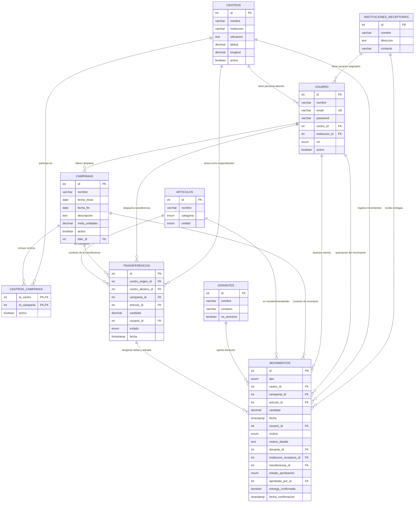
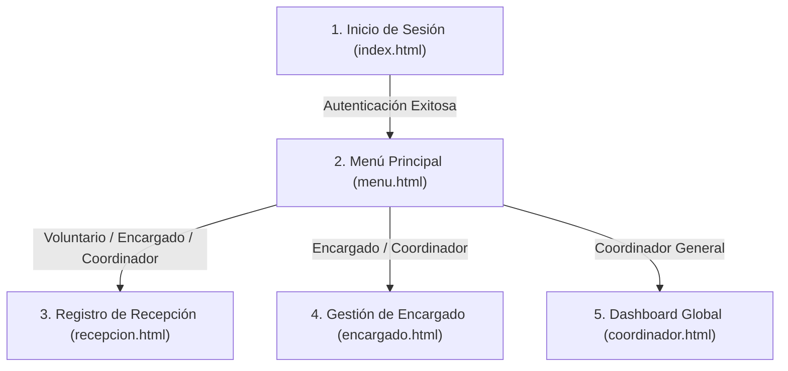

# Documentación Técnica del Sistema de Registro y Coordinación de Centros de Acopio (<in>Hack)

> **Equipo de Desarrollo:** *fsociety*  
> **Versión de Documentación:** 1.0.0  
> **Fecha de Última Actualización:** 2026-09-03  
> **Estado del Proyecto:** En desarrollo activo (Módulo de Base de Datos y Servicios Core completados)  

---

## 1. Introducción y Visión General del Proyecto

### 1.1 Contexto y Problemática
Durante contingencias humanitarias, desastres naturales (sismos, huracanes, inundaciones) o campañas institucionales de recaudación, diversas entidades como universidades, organizaciones no gubernamentales (ONG), templos y centros comunitarios habilitan centros de acopio temporales.

Tradicionalmente, cada centro opera como una "isla informativa" mediante libretas físicas o formatos desarticulados de hojas de cálculo:
1. **Falta de visibilidad centralizada:** La coordinación general desconoce las existencias exactas y el inventario disponible en cada sede en tiempo real.
2. **Cero trazabilidad:** No se cuenta con un registro fidedigno que identifique quién recibió qué donación, a qué comunidad o institución beneficiaria se entregó, qué productos se echaron a perder (mermas) o qué mercancía fue trasladada entre sedes.
3. **Decisiones a ciegas y colapso logístico:** La ausencia de datos consolidados genera asimetrías críticas: centros sobreabastecidos con insumos a punto de caducar mientras otras sedes sufren desabasto crítico de productos de primera necesidad.

### 1.2 Objetivo del Sistema
Construir una plataforma tecnológica centralizada, robusta, auditable y accesible que resuelva la logística integral de centros de acopio mediante:
* **Control administrativo central:** Gestión de campañas, apertura/cierre de sedes y monitoreo analítico global.
* **Operación ágil en campo:** Interfaces simples para encargados y voluntarios en el registro de donaciones y canalizaciones.
* **Libro mayor inmutable de inventario:** El stock no se edita directamente; es el resultado matemático auditable de los movimientos registrados.
* **Trazabilidad 360°:** Todo movimiento cuenta con marca de tiempo, actor responsable, origen, destino y justificación obligatoria.

---

## 2. Mapa Arquitectónico de la Documentación

El presente documento consolida la arquitectura y especificación integral del proyecto en base a los requerimientos y reglas del reto (`CONTEXTO_PROYECTO.md`). Está estructurado en cuatro secciones técnicas maestras:

```
DOCUMENTACIÓN INTEGRAL DEL PROYECTO
│
├── 📁 SECCIÓN I: ARQUITECTURA DE BASE DE DATOS Y PERSISTENCIA (COMPLETO)
│   ├── 1. Fundamentos y Decisiones de Diseño
│   ├── 2. Correcciones Técnicas y Adaptación a TiDB Cloud / MySQL Serverless
│   ├── 3. Modelo Conceptual y Diagrama Entidad-Relación (EER)
│   ├── 4. Diccionario de Datos y Especificación DDL (centros_acopio_db.sql)
│   ├── 5. Vista Oficial de Stock y Lógica Inmutable de Inventario
│   ├── 6. Guía Operativa de Procedimientos Almacenados
│   ├── 7. Datos Semilla (Seeds / Fixtures) para Demostración
│   └── 8. Guía de Despliegue y Ejecución SQL
│
├── 📁 SECCIÓN II: CAPA BACKEND Y REGLAS DE NEGOCIO (COMPLETO)
│   ├── 1. Stack Tecnológico y Configuración (Java 17 / Spring Boot 3)
│   ├── 2. Arquitectura en Capas (Controller - Service - Repository - Model - DTO)
│   ├── 3. Matriz de Control de Acceso y Roles (RBAC)
│   ├── 4. Catálogo de APIs REST y Contratos de Entrada/Salida
│   └── 5. Reglas de Negocio, Trazabilidad y Prevención de Stock Negativo
│
├── 📁 SECCIÓN III: CAPA FRONTEND Y EXPERIENCIA DE USUARIO (COMPLETO)
│   ├── 1. Estructura de Vistas e Interfaces de Usuario
│   ├── 2. Flujo de Navegación y Permisos Visuales Dinámicos
│   ├── 3. Pantalla de Recepción de Donaciones
│   ├── 4. Panel Operativo de Encargado de Centro
│   └── 5. Dashboard Global y Centro de Mando del Coordinador
│
└── 📁 SECCIÓN IV: MATRIZ DE CRITERIOS DE ACEPTACIÓN, DEPLOYMENT Y DEVOPS (COMPLETO)
    ├── 1. Checklist de Criterios de Aceptación del MVP (<in>Hack)
    ├── 2. Cuentas de Acceso de Prueba para Evaluación
    ├── 3. Empaquetado, Dockerización y Ejecución Multiplataforma
    └── 4. Declaración de Uso de IA y Diferenciadores de Innovación
```

---

## 3. SECCIÓN I: ARQUITECTURA Y DESARROLLO DE LA BASE DE DATOS

> **Archivo Fuente SQL:** [`db/centros_acopio_db.sql`](file:///c:/Users/Adan1/Documents/Hackathon/proyecto_hackaton_fsociety/db/centros_acopio_db.sql)  
> **Guía de Integración Técnica:** [`docs/GUIA_PROCEDIMIENTOS_ALMACENADOS.md`](file:///c:/Users/Adan1/Documents/Hackathon/proyecto_hackaton_fsociety/docs/GUIA_PROCEDIMIENTOS_ALMACENADOS.md)  
> **Motor de Base de Datos:** MySQL 8.0+ alojado en **Clever Cloud** (con soporte y compatibilidad para TiDB Cloud / MySQL Serverless)  
> **Conjunto de Caracteres:** `utf8mb4`  
> **Cotejo (Collation):** `utf8mb4_unicode_ci`  

---

### 3.1 Fundamentos y Decisiones de Diseño de la Base de Datos

1. **Persistencia Híbrida en Nube:** Inicialmente concebido para TiDB Cloud, el esquema fue migrado a **Clever Cloud MySQL 8** (`b0efvzjhpegivufhzick-mysql.services.clever-cloud.com:3306`), garantizando acceso remoto colaborativo 24/7 y despliegue sin depender del `localhost` de la máquina de desarrollo.
2. **Encapsulamiento de Reglas en Procedimientos Almacenados (SPs):** Para proteger la integridad referencial y garantizar que ninguna aplicación externa viole las restricciones de stock ni inserte registros huérfanos, todas las operaciones de escritura y cálculo analítico se canalizan a través de 31 Stored Procedures con manejo de excepciones mediante `SIGNAL SQLSTATE '45000'`.
3. **Ausencia de Triggers Pesados:** Dado que los triggers pueden degradar el rendimiento en entornos en la nube y generar bloqueos imprevistos, la lógica de validación atómica se delegó a los procedimientos almacenados y transacciones explícitas (`START TRANSACTION ... COMMIT`).
4. **Principio de Libro Mayor (Audit Ledger):** La tabla `movimientos` es estrictamente aditiva (inmutable). No existen sentencias `UPDATE` o `DELETE` sobre las cantidades de los movimientos históricos. Cualquier corrección en almacén se asienta formalmente con un `AJUSTE_POSITIVO` o `AJUSTE_NEGATIVO` con justificación obligatoria.

---

### 3.2 Correcciones Técnicas Recientes y Adaptaciones Cloud (Clever Cloud)

Durante el despliegue e integración continua del script [`centros_acopio_db.sql`](file:///c:/Users/Adan1/Documents/Hackathon/proyecto_hackaton_fsociety/db/centros_acopio_db.sql) en el entorno de Clever Cloud, se incorporaron dos correcciones críticas de ingeniería de bases de datos:

#### A. Adaptación del Nombre de Esquema por Políticas de PaaS Cloud
* **Problema detectado:** En plataformas de base de datos compartida como Clever Cloud, las instancias se aprovisionan con un esquema e identificador único generado por la plataforma (ej. `b0efvzjhpegivufhzick`). El usuario de conexión carece de permisos de superadministrador para ejecutar la sentencia `CREATE DATABASE centros_acopio;`, lo que provocaba un fallo de privilegios insuficientes (`Access denied for user`).
* **Solución aplicada:** Se comentó la instrucción de creación de base de datos y se fijó el uso del esquema asignado:
  ```sql
  -- el nombre ya no es centros de acopio debido a las limitaciones que tiene clever cloud que es donde alojamos la BD
  -- create database if not exists centros_acopio;
  use b0efvzjhpegivufhzick;
  ```
* **Impacto en el Backend:** Se ajustó la cadena de conexión JDBC en [`application.properties`](file:///c:/Users/Adan1/Documents/Hackathon/proyecto_hackaton_fsociety/src/main/resources/application.properties) apuntando a `jdbc:mysql://b0efvzjhpegivufhzick-mysql.services.clever-cloud.com:3306/b0efvzjhpegivufhzick?useSSL=true&serverTimezone=UTC`.

#### B. Mecanismo de Limpieza Idempotente con `SET FOREIGN_KEY_CHECKS = 0`
* **Problema detectado:** Cuando se reejecutaba el script para aplicar nuevas columnas (`latitud`, `longitud`, `meta_unidades`) o actualizar índices, la cláusula `CREATE TABLE IF NOT EXISTS` ignoraba silenciosamente las tablas existentes, impidiendo que los cambios estructurales se materializaran. Adicionalmente, intentar hacer `DROP TABLE` individual fallaba con errores de integridad referencial debido a las llaves foráneas cruzadas (`Cannot drop table referenced by a foreign key constraint`).
* **Solución aplicada:** Se implementó una cabecera de limpieza atómica e idempotente antes de la definición DDL:
  ```sql
  -- Limpieza segura para garantizar que las tablas se creen con todas las columnas e índices nuevos
  SET FOREIGN_KEY_CHECKS = 0;
  DROP VIEW IF EXISTS v_stock_actual;
  DROP TABLE IF EXISTS centros_campanias, transferencias, movimientos, donantes, articulos, campanias, usuario, centros, instituciones_receptoras;
  SET FOREIGN_KEY_CHECKS = 1;
  ```
* **Beneficio técnico:** 
  1. Desactiva momentáneamente la validación de dependencias circulares de llaves foráneas.
  2. Elimina en cascada vistas y tablas obsoletas.
  3. Reactiva la integridad referencial para que las nuevas tablas se generen con su definición completa, índices optimizados y datos semilla actualizados.
  4. Garantiza que el script sea **100% idempotente y reproducible**.

---

### 3.3 Diagrama Entidad-Relación Conceptual (EER)

El siguiente diagrama detalla la topología de las 9 entidades del sistema, sus relaciones de cardinalidad y las llaves foráneas que articulan la plataforma:



---

### 3.4 Diccionario de Datos y Especificación DDL

A continuación se detalla la estructura, propósitos funcionales y restricciones de cada tabla creada en [`centros_acopio_db.sql`](file:///c:/Users/Adan1/Documents/Hackathon/proyecto_hackaton_fsociety/db/centros_acopio_db.sql):

#### 1. Tabla: `instituciones_receptoras`
Almacena los organismos, albergues, comedores comunitarios o brigadas de auxilio que reciben insumos canalizados desde los centros de acopio.
* `id` (`INT`, PK, Auto-increment): Identificador único de la entidad receptora.
* `nombre` (`VARCHAR(150)`, Not Null): Razón social o nombre común del albergue/institución.
* `direccion` (`TEXT`, Not Null): Domicilio físico donde se canalizan las entregas.
* `contacto` (`VARCHAR(100)`, Null): Teléfono o enlace institucional de contacto.

#### 2. Tabla: `centros`
Modela cada sede física habilitada para el acopio y custodia temporal de insumos.
* `id` (`INT`, PK, Auto-increment): Identificador del centro.
* `nombre` (`VARCHAR(150)`, Not Null): Nombre público (ej. "Campus Central - Explanada").
* `institucion` (`VARCHAR(150)`, Not Null): Universidad u organización titular responsable de la sede.
* `ubicacion` (`TEXT`, Not Null): Dirección física o referencia geográfica de acceso.
* `latitud` (`DECIMAL(10,8)`, Null): Coordenada geográfica para visualización en mapa interactivo (Innovación 9.3).
* `longitud` (`DECIMAL(11,8)`, Null): Coordenada geográfica para visualización en mapa interactivo (Innovación 9.3).
* `activo` (`BOOLEAN`, Not Null, Default `TRUE`): Indica si el centro está habilitado para recibir insumos.

#### 3. Tabla: `usuario`
Implementa la autenticación y el control de acceso basado en roles (RBAC) jerárquico.
* `id` (`INT`, PK, Auto-increment): Identificador del usuario.
* `nombre` (`VARCHAR(100)`, Not Null): Nombre completo del operador.
* `email` (`VARCHAR(150)`, Not Null, Unique): Correo electrónico corporativo o institucional para inicio de sesión.
* `password` (`VARCHAR(255)`, Not Null): Contraseña cifrada en hash (BCrypt).
* `centro_id` (`INT`, Null, FK `centros.id`): Centro al que está adscrito el usuario (obligatorio para Encargados y Voluntarios).
* `institucion_id` (`INT`, Null, FK `instituciones_receptoras.id`): Institución a la que pertenece el usuario externo.
* `rol` (`ENUM`, Not Null): Rol dentro del sistema:
  * `'COORDINADOR'`: Administración global del sistema.
  * `'ENCARGADO'`: Administración operativa de su centro.
  * `'VOLUNTARIO'`: Captura rápida de recepciones y entregas estándar.
  * `'INSTITUCION'`: Visualización y confirmación de entregas dirigidas a su organismo.
  * `'LIDER'`: Gestión analítica de una campaña específica.
* `activo` (`BOOLEAN`, Not Null, Default `TRUE`): Estado de la cuenta de usuario.

#### 4. Tabla: `campanias`
Registra las contingencias de emergencia o causas benéficas que agrupan los esfuerzos de acopio.
* `id` (`INT`, PK, Auto-increment): Identificador de la campaña.
* `nombre` (`VARCHAR(150)`, Not Null): Nombre oficial (ej. "Plan Huracán 2026").
* `fecha_inicio` (`DATE`, Not Null): Fecha formal de apertura.
* `fecha_fin` (`DATE`, Null): Fecha límite proyectada (nulo mientras la emergencia siga activa).
* `descripcion` (`TEXT`, Null): Objetivo humanitario de la campaña.
* `meta_unidades` (`DECIMAL(10,2)`, Null, Default `0.00`): Meta de recolección global para cálculo de avance porcentual (Innovación 9.4).
* `activo` (`BOOLEAN`, Not Null, Default `TRUE`): Vigencia operativa de la campaña.
* `lider_id` (`INT`, Null, FK `usuario.id`): Usuario asignado como líder estratégico (Innovación 9.1).

#### 5. Tabla: `centros_campanias`
Tabla de unión (Muchos a Muchos) que determina explícitamente qué centros están autorizados para recolectar bienes en cada campaña.
* `id_centro` (`INT`, Not Null, FK `centros.id`): Identificador del centro.
* `id_campania` (`INT`, Not Null, FK `campanias.id`): Identificador de la campaña.
* `activo` (`BOOLEAN`, Not Null, Default `TRUE`): Estado de la participación del centro.
* **Llave Primaria Compuesta:** `(id_centro, id_campania)`.

#### 6. Tabla: `articulos`
Catálogo estandarizado de bienes e insumos susceptibles de recolección.
* `id` (`INT`, PK, Auto-increment): Identificador del insumo.
* `nombre` (`VARCHAR(100)`, Not Null): Denominación del artículo (ej. "Arroz en grano", "Paracetamol 500mg").
* `categoria` (`ENUM`, Not Null): Clasificación obligatoria según el dominio:
  * `'NO_PERECEDERO'`, `'PERECEDERO'`, `'ROPA'`, `'LIMPIEZA'`, `'MEDICAMENTO'`, `'OTRO'`.
* `unidad` (`ENUM`, Not Null): Unidad de medida estándar:
  * `'PIEZA'`, `'KG'`, `'L'`, `'BOLSA'`, `'CAJA'`.

#### 7. Tabla: `donantes`
Padrón de benefactores que aportan insumos en los centros de acopio.
* `id` (`INT`, PK, Auto-increment): Identificador del donante.
* `nombre` (`VARCHAR(150)`, Null): Nombre de la persona o razón social de la empresa donante.
* `contacto` (`VARCHAR(100)`, Null): Teléfono o correo para agradecimientos o auditorías.
* `es_anonimo` (`BOOLEAN`, Not Null, Default `FALSE`): Marca de donación anónima (cumpliendo la regla del donante en campo).

#### 8. Tabla: `transferencias`
Registra la orden logística maestra de traslado de mercancías entre dos sedes activas.
* `id` (`INT`, PK, Auto-increment): Identificador de la transferencia.
* `centro_origen_id` (`INT`, Not Null, FK `centros.id`): Sede que envía insumos con excedente.
* `centro_destino_id` (`INT`, Not Null, FK `centros.id`): Sede que recibe los insumos.
* `campania_id` (`INT`, Not Null, FK `campanias.id`): Campaña bajo la cual se realiza el traslado.
* `articulo_id` (`INT`, Not Null, FK `articulos.id`): Insumo transferido.
* `cantidad` (`DECIMAL(10,2)`, Not Null): Volumen transferido.
* `usuario_id` (`INT`, Not Null, FK `usuario.id`): Operador que autorizó/despachó el envío.
* `estado` (`ENUM`, Not Null, Default `'PENDIENTE'`): `'PENDIENTE'`, `'COMPLETADA'`, `'CANCELADA'`.
* `fecha` (`TIMESTAMP`, Not Null, Default `CURRENT_TIMESTAMP`): Momento exacto de registro.
* **Constraints Integradas:**
  * `chk_transf_centros`: `CHECK (centro_origen_id <> centro_destino_id)` (Previene transferencias a sí mismo).
  * `chk_transf_cantidad`: `CHECK (cantidad > 0)` (Prohibido cantidades negativas o en cero).

#### 9. Tabla: `movimientos` (Libro Mayor Inmutable)
Es la entidad central del sistema. Cada renglón representa un evento físico inmutable con impacto en inventario.
* `id` (`INT`, PK, Auto-increment): Identificador único de auditoría.
* `tipo` (`ENUM`, Not Null): Tipología de movimiento:
  * `'RECEPCION'`: Entrada por donación.
  * `'ENTREGA'`: Salida canalizada a institución/beneficiario.
  * `'MERMA'`: Salida por deterioro, daño o caducidad.
  * `'TRANSFERENCIA_SALIDA'`: Salida originada por traspaso a otro centro.
  * `'TRANSFERENCIA_ENTRADA'`: Entrada originada por traspaso desde otro centro.
  * `'AJUSTE_POSITIVO'`: Incremento correctivo por auditoría física.
  * `'AJUSTE_NEGATIVO'`: Decremento correctivo por auditoría física.
* `centro_id` (`INT`, Not Null, FK `centros.id`): Centro donde se registra la operación.
* `campania_id` (`INT`, Not Null, FK `campanias.id`): Campaña vinculada.
* `articulo_id` (`INT`, Not Null, FK `articulos.id`): Artículo afectado.
* `cantidad` (`DECIMAL(10,2)`, Not Null): Cantidad transferida o movida (`CHECK (cantidad > 0)`).
* `fecha` (`TIMESTAMP`, Not Null, Default `CURRENT_TIMESTAMP`): Sello de tiempo automático inalterable.
* `usuario_id` (`INT`, Not Null, FK `usuario.id`): Actor que realizó la captura física.
* `motivo` (`ENUM`, Null): Motivo obligatorio en mermas y ajustes:
  * `'CADUCIDAD'`, `'DANO'`, `'PERDIDA'`, `'CORRECCION_CONTEO'`, `'ERROR_CAPTURA'`, `'OTRO'`.
* `motivo_detalle` (`TEXT`, Null): Explicación cualitativa complementaria.
* `donante_id` (`INT`, Null, FK `donantes.id`): Referencia en recepciones.
* `institucion_receptora_id` (`INT`, Null, FK `instituciones_receptoras.id`): Referencia en entregas.
* `transferencia_id` (`INT`, Null, FK `transferencias.id`): Referencia a la orden maestra de traspaso.
* `estado_aprobacion` (`ENUM`, Not Null, Default `'APROBADO'`): `'PENDIENTE'`, `'APROBADO'`, `'RECHAZADO'` (Soporte para flujo de aprobación de merma por Coordinador - Innovación 9.2).
* `aprobado_por_id` (`INT`, Null, FK `usuario.id`): Coordinador que autorizó la merma.
* `entrega_confirmada` (`BOOLEAN`, Not Null, Default `FALSE`): Estado de recepción por la institución receptora.
* `fecha_confirmacion` (`TIMESTAMP`, Null): Marca de tiempo en que la institución externa confirmó la entrega.

---

### 3.5 Vista Oficial de Stock Actual (`v_stock_actual`)

Para garantizar el cumplimiento de la **Regla Fundamental de Negocio (Sección 5 del Contexto del Proyecto)**, el stock nunca se guarda en un campo editable. Se calcula dinámicamente mediante la siguiente vista oficial optimizada:

```sql
create or replace view v_stock_actual as
select 
    m.centro_id,
    m.campania_id,
    m.articulo_id,
    sum(
        case 
            when m.tipo in ('RECEPCION', 'TRANSFERENCIA_ENTRADA', 'AJUSTE_POSITIVO') then m.cantidad
            when m.tipo in ('ENTREGA', 'MERMA', 'TRANSFERENCIA_SALIDA', 'AJUSTE_NEGATIVO') then -m.cantidad
            else 0
        end
    ) as stock_disponible
from movimientos m
where m.estado_aprobacion = 'APROBADO'
group by m.centro_id, m.campania_id, m.articulo_id;
```

#### Optimización e Índices de Desempeño
Para asegurar que la vista calcule el inventario en milisegundos incluso ante miles de movimientos históricos, se crearon los siguientes índices compuestos en [`centros_acopio_db.sql`](file:///c:/Users/Adan1/Documents/Hackathon/proyecto_hackaton_fsociety/db/centros_acopio_db.sql#L169-L170):
```sql
create index idx_mov_centro_camp_art on movimientos (centro_id, campania_id, articulo_id);
create index idx_mov_fecha on movimientos (fecha);
```

---

### 3.6 Catálogo y Guía Operativa de los 31 Procedimientos Almacenados

La totalidad de operaciones del sistema están desacopladas en **31 Stored Procedures** documentados en detalle en la [GUIA_PROCEDIMIENTOS_ALMACENADOS.md](file:///c:/Users/Adan1/Documents/Hackathon/proyecto_hackaton_fsociety/docs/GUIA_PROCEDIMIENTOS_ALMACENADOS.md). A continuación se presenta el manual de referencia clasificado por dominios funcionales:

```
ÍNDICE DE PROCEDIMIENTOS ALMACENADOS
├── MÓDULO 1: CORE DE INVENTARIO Y MOVIMIENTOS (SPs 1 al 5)
├── MÓDULO 2: AUTENTICACIÓN, SESIÓN Y RBAC (SPs 6 al 8)
├── MÓDULO 3: GESTIÓN DE CENTROS Y CAMPAÑAS (SPs 9 al 15)
├── MÓDULO 4: CATÁLOGOS Y SELECTORES DINÁMICOS (SPs 16 al 20)
├── MÓDULO 5: INSTITUCIÓN RECEPTORA Y CONFIRMACIONES (SPs 21 y 22)
├── MÓDULO 6: KÁRDEX, AUDITORÍA Y STOCK EN VIVO (SPs 23 y 24)
├── MÓDULO 7: DASHBOARDS Y ANALÍTICA EJECUTIVA (SPs 25 al 29)
└── MÓDULO 8: INNOVACIÓN Y DIFERENCIADORES <in>Hack (SPs 30 y 31)
```

---

#### MÓDULO 1: Core de Inventario y Movimientos de Almacén

##### SP 1: `sp_registrar_recepcion_donacion`
* **Propósito:** Da entrada a insumos donados (anónimos o nominales) incrementando el stock del centro de inmediato.
* **Parámetros:**
  * `p_centro_id` (`INT`): ID del centro de acopio.
  * `p_campania_id` (`INT`): ID de la campaña activa.
  * `p_articulo_id` (`INT`): ID del artículo donado.
  * `p_cantidad` (`DECIMAL(10,2)`): Cantidad positiva recibida.
  * `p_usuario_id` (`INT`): ID del voluntario/encargado en turno.
  * `p_es_anonimo` (`BOOLEAN`): `TRUE` para donación anónima.
  * `p_donante_nombre` (`VARCHAR(150)`): Nombre del donante (o nulo si es anónimo).
  * `p_donante_contacto` (`VARCHAR(100)`): Teléfono/correo del donante.
* **Validaciones:** Cantidad mayor a cero, centro activo, campaña activa y centro adscrito a la campaña.
* **Invocación SQL:**
  ```sql
  CALL sp_registrar_recepcion_donacion(1, 1, 1, 50.00, 2, FALSE, 'Juan Pérez', '555-9876');
  ```
* **Retorna:** `movimiento_id`, `tipo`, `cantidad_recibida`, `stock_actual`, `mensaje`.

---

##### SP 2: `sp_registrar_entrega`
* **Propósito:** Registra la salida canalizada hacia una institución receptora o comunidad beneficiaria.
* **Parámetros:**
  * `p_centro_id` (`INT`): Centro emisor.
  * `p_campania_id` (`INT`): Campaña asociada.
  * `p_articulo_id` (`INT`): Insumo entregado.
  * `p_cantidad` (`DECIMAL(10,2)`): Volumen a entregar.
  * `p_institucion_receptora_id` (`INT`): Institución destinataria.
  * `p_usuario_id` (`INT`): Operador que autoriza y entrega.
* **Validaciones:** Prohibición estricta de stock negativo (`IF v_stock_actual < p_cantidad THEN SIGNAL SQLSTATE '45000'`). Existencia de la institución receptora.
* **Invocación SQL:**
  ```sql
  CALL sp_registrar_entrega(1, 1, 1, 20.00, 1, 2);
  ```
* **Retorna:** `movimiento_id`, `tipo`, `cantidad_entregada`, `stock_restante`, `mensaje`.

---

##### SP 3: `sp_registrar_merma`
* **Propósito:** Asienta la baja de productos inutilizables por caducidad, rotura o extravío con justificación forzosa.
* **Parámetros:**
  * `p_centro_id`, `p_campania_id`, `p_articulo_id`, `p_cantidad`, `p_usuario_id`.
  * `p_motivo` (`VARCHAR(50)`): Debe pertenecer a: `'CADUCIDAD'`, `'DANO'`, `'PERDIDA'`, `'OTRO'`.
  * `p_motivo_detalle` (`TEXT`): Explicación complementaria de los hechos.
* **Validaciones:** Cantidad positiva, stock suficiente y motivo obligatorio no nulo.
* **Invocación SQL:**
  ```sql
  CALL sp_registrar_merma(1, 1, 1, 5.00, 'CADUCIDAD', 'Empaque perforado durante la estiba', 2);
  ```

---

##### SP 4: `sp_registrar_transferencia_centros`
* **Propósito:** Ejecuta una reasignación atómica entre dos centros de la misma campaña (salida en origen + entrada en destino).
* **Parámetros:**
  * `p_centro_origen_id`, `p_centro_destino_id`, `p_campania_id`, `p_articulo_id`, `p_cantidad`, `p_usuario_id`.
* **Mecanismo:** Envuelto en `START TRANSACTION ... COMMIT` para evitar asimetrías de inventario si ocurre una interrupción de red.
* **Invocación SQL:**
  ```sql
  CALL sp_registrar_transferencia_centros(1, 2, 1, 1, 30.00, 2);
  ```

---

##### SP 5: `sp_registrar_ajuste_stock`
* **Propósito:** Regulariza discrepancias físicas detectadas tras auditorías de conteo en almacén.
* **Parámetros:**
  * `p_centro_id`, `p_campania_id`, `p_articulo_id`, `p_cantidad`.
  * `p_tipo_ajuste` (`VARCHAR(20)`): `'AJUSTE_POSITIVO'` o `'AJUSTE_NEGATIVO'`.
  * `p_motivo` (`VARCHAR(50)`): `'CORRECCION_CONTEO'`, `'ERROR_CAPTURA'`, etc.
  * `p_motivo_detalle` (`TEXT`): Dictamen de auditoría.
  * `p_usuario_id` (`INT`): Encargado o auditor que firma el ajuste.
* **Invocación SQL:**
  ```sql
  CALL sp_registrar_ajuste_stock(1, 1, 1, 3.00, 'AJUSTE_POSITIVO', 'CORRECCION_CONTEO', 'Insumos hallados en estante secundario', 2);
  ```

---

#### MÓDULO 2: Autenticación, Sesión y RBAC

##### SP 6: `sp_autenticar_usuario`
* **Propósito:** Consulta de credenciales y contexto de sesión para el inicio de sesión.
* **Parámetros:** `p_email` (`VARCHAR(150)`).
* **Retorna:** `usuario_id`, `nombre`, `email`, `password_hash`, `rol`, `centro_id`, `centro_nombre`, `institucion_id`, `institucion_nombre`, `activo`.
* **Invocación SQL:**
  ```sql
  CALL sp_autenticar_usuario('coordinador@hackaton.org');
  ```

##### SP 7: `sp_crear_usuario`
* **Propósito:** Registro controlado de personal operativo, encargados o líderes validando integridad de rol.
* **Parámetros:** `p_nombre`, `p_email`, `p_password`, `p_centro_id`, `p_institucion_id`, `p_rol`.
* **Invocación SQL:**
  ```sql
  CALL sp_crear_usuario('Ana Martínez', 'ana.encargada@hackaton.org', 'password123', 2, NULL, 'ENCARGADO');
  ```

##### SP 8: `sp_cambiar_estado_usuario`
* **Propósito:** Activar o suspender accesos al sistema sin destruir registros históricos.
* **Parámetros:** `p_usuario_id`, `p_nuevo_estado` (`BOOLEAN`).
* **Invocación SQL:**
  ```sql
  CALL sp_cambiar_estado_usuario(3, FALSE);
  ```

---

#### MÓDULO 3: Gestión Maestra de Centros y Campañas

##### SP 9: `sp_crear_centro_acopio`
* **Propósito:** Alta de nueva sede física incluyendo soporte para geolocalización.
* **Parámetros:** `p_nombre`, `p_institucion`, `p_ubicacion`, `p_latitud`, `p_longitud`.
* **Invocación SQL:**
  ```sql
  CALL sp_crear_centro_acopio('Centro Deportivo Sur', 'Alcaldía Coyoacán', 'Calzada del Hueso 100', 19.30500000, -99.12400000);
  ```

##### SP 10: `sp_editar_centro_acopio`
* **Propósito:** Modificación de metadatos o coordenadas de un centro existente.

##### SP 11: `sp_cambiar_estado_centro`
* **Propósito:** Habilita o deshabilita temporalmente la operación de un centro de acopio.

##### SP 12: `sp_crear_campania`
* **Propósito:** Apertura de causa o contingencia estableciendo metas y fechas límite.
* **Parámetros:** `p_nombre`, `p_descripcion`, `p_fecha_inicio`, `p_fecha_fin`, `p_meta_unidades`, `p_lider_id`.
* **Invocación SQL:**
  ```sql
  CALL sp_crear_campania('Alivio Sismo Costa 2026', 'Recolección de víveres', '2026-09-01', NULL, 10000.00, 5);
  ```

##### SP 13: `sp_editar_campania`
* **Propósito:** Actualización de detalles, líder asignado o reajuste de metas cuantitativas.

##### SP 14: `sp_cambiar_estado_campania`
* **Propósito:** Cierre oficial de campaña cuando la contingencia ha sido resuelta.

##### SP 15: `sp_asociar_centro_campania`
* **Propósito:** Vincula un centro a una campaña mediante `INSERT ... ON DUPLICATE KEY UPDATE activo = p_activo`.
* **Invocación SQL:**
  ```sql
  CALL sp_asociar_centro_campania(1, 1, TRUE);
  ```

---

#### MÓDULO 4: Catálogos y Selectores Dinámicos (Dropdowns de Formularios)

##### SP 16: `sp_crear_articulo`
* **Propósito:** Agrega un nuevo ítem al catálogo estandarizado con su categoría y unidad.
* **Invocación SQL:**
  ```sql
  CALL sp_crear_articulo('Lentejas en bolsa 500g', 'NO_PERECEDERO', 'BOLSA');
  ```

##### SP 17: `sp_listar_articulos`
* **Propósito:** Alimenta los `<select>` de insumos en formularios de recepción y entrega, con opción de filtrar por categoría.
* **Invocación SQL:**
  ```sql
  CALL sp_listar_articulos(NULL); -- Lista todo el catálogo
  CALL sp_listar_articulos('MEDICAMENTO'); -- Solo medicinas
  ```

##### SP 18: `sp_listar_instituciones_receptoras`
* **Propósito:** Lista los albergues e instituciones disponibles para canalizar entregas.

##### SP 19: `sp_listar_campanias_activas_centro`
* **Propósito:** Devuelve únicamente las campañas vigentes en las que el centro específico está formalmente habilitado para recibir insumos.
* **Invocación SQL:**
  ```sql
  CALL sp_listar_campanias_activas_centro(1);
  ```

##### SP 20: `sp_listar_centros_destino_transferencia`
* **Propósito:** Lista los centros participantes en la campaña **excluyendo el centro emisor** para evitar transferencias circulares erróneas.
* **Invocación SQL:**
  ```sql
  CALL sp_listar_centros_destino_transferencia(1, 1);
  ```

---

#### MÓDULO 5: Institución Receptora y Confirmaciones Externas

##### SP 21: `sp_consultar_entregas_institucion`
* **Propósito:** Permite a una institución receptora consultar los insumos que le han sido despachados desde cualquier centro.
* **Parámetros:** `p_institucion_id` (`INT`), `p_solo_pendientes` (`BOOLEAN`).
* **Invocación SQL:**
  ```sql
  CALL sp_consultar_entregas_institucion(1, TRUE);
  ```

##### SP 22: `sp_confirmar_entrega_recibida`
* **Propósito:** Cierra el ciclo de trazabilidad permitiendo al representante de la institución receptora marcar la entrega como "Recibida", registrando el timestamp exacto de recepción.
* **Invocación SQL:**
  ```sql
  CALL sp_confirmar_entrega_recibida(2, 4);
  ```

---

#### MÓDULO 6: Kárdex, Auditoría y Stock en Vivo

##### SP 23: `sp_obtener_stock_centro`
* **Propósito:** Obtiene el inventario disponible en tiempo real de una sede filtrable por campaña, omitiendo aquellos artículos con stock en cero.
* **Invocación SQL:**
  ```sql
  CALL sp_obtener_stock_centro(1, 1);
  ```

##### SP 24: `sp_consultar_historial_movimientos`
* **Propósito:** Kárdex de auditoría global multicriterio. Permite auditar quién, cuándo y por qué se movió cada insumo con filtros combinables (centro, campaña, insumo, tipo de movimiento, rango de fechas).
* **Invocación SQL:**
  ```sql
  CALL sp_consultar_historial_movimientos(1, 1, NULL, 'MERMA', '2026-09-01', '2026-09-30');
  ```

---

#### MÓDULO 7: Dashboards y Analítica Ejecutiva

##### SP 25: `sp_dashboard_coordinador_global`
* **Propósito:** Retorna los KPIs macro de la coordinación general: total recaudado, total entregado, total de merma, stock global neto, meta de recolección y porcentaje de avance hacia la meta.
* **Invocación SQL:**
  ```sql
  CALL sp_dashboard_coordinador_global(1);
  ```

##### SP 26: `sp_dashboard_comparativa_centros`
* **Propósito:** Genera la tabla comparativa de desempeño y balance logístico de cada centro (total recibido, entregado, merma y stock remanente). Esencial para detectar asimetrías y ordenar transferencias.
* **Invocación SQL:**
  ```sql
  CALL sp_dashboard_comparativa_centros(1);
  ```

##### SP 27: `sp_dashboard_articulos_mas_donados`
* **Propósito:** Retorna el Top N de artículos con mayor volumen y frecuencia de donación para gráficas de barras o pasteles.
* **Invocación SQL:**
  ```sql
  CALL sp_dashboard_articulos_mas_donados(1, 5);
  ```

##### SP 28: `sp_dashboard_encargado_centro`
* **Propósito:** Cuadro de mando operativo propio de cada encargado de centro: stock total, recibido hoy, entregado hoy, entregas pendientes de confirmación y merma acumulada de su sede.
* **Invocación SQL:**
  ```sql
  CALL sp_dashboard_encargado_centro(1);
  ```

##### SP 29: `sp_dashboard_lider_campania`
* **Propósito:** Métricas exclusivas para el Líder de Campaña con validación de seguridad (solo el líder asignado o el Coordinador General pueden consultarlo). Muestra el avance frente a la meta y el conteo de centros participantes.
* **Invocación SQL:**
  ```sql
  CALL sp_dashboard_lider_campania(1, 5);
  ```

---

#### MÓDULO 8: Innovación y Diferenciadores (<in>Hack)

##### SP 30: `sp_aprobar_merma` (Innovación 9.2: Aprobación de Mermas)
* **Propósito:** Permite al Coordinador General revisar las mermas registradas y cambiar su estado de `'PENDIENTE'` a `'APROBADO'` o `'RECHAZADO'`, evitando que se descuenten del inventario físico hasta contar con visto bueno administrativo.
* **Invocación SQL:**
  ```sql
  CALL sp_aprobar_merma(15, 1, 'APROBADO');
  ```

##### SP 31: `sp_obtener_centros_mapa` (Innovación 9.3: Mapa Interactivo)
* **Propósito:** Devuelve la lista de centros activos que disponen de coordenadas geográficas (`latitud`, `longitud`), junto con el total de stock disponible en cada uno, listo para alimentar librerías cartográficas como **Leaflet.js** o **Mapbox**.
* **Invocación SQL:**
  ```sql
  CALL sp_obtener_centros_mapa(1);
  ```

---

### 3.7 Datos Semilla (Fixtures / Seeds para Demostración)

En la sección final de [`centros_acopio_db.sql`](file:///c:/Users/Adan1/Documents/Hackathon/proyecto_hackaton_fsociety/db/centros_acopio_db.sql#L1598-L1669) se integran fixtures realistas para habilitar la prueba inmediata del sistema:

1. **Instituciones Receptoras:**
   * `id = 1`: Albergue Comunitario Esperanza (`555-123-4567`).
   * `id = 2`: Comedor Solidario San José (`555-987-6543`).
2. **Centros de Acopio (con geolocalización CDMX):**
   * `id = 1`: Campus Central - Explanada (Lat: `19.3323`, Lon: `-99.1865`).
   * `id = 2`: Sede Comunitaria Norte - Cruz Roja (Lat: `19.4852`, Lon: `-99.1623`).
3. **Usuarios de Prueba por Rol (RBAC):**
   * `coordinador@hackaton.org` (`COORDINADOR`)
   * `encargado.central@hackaton.org` (`ENCARGADO`, Centro 1)
   * `voluntario.central@hackaton.org` (`VOLUNTARIO`, Centro 1)
   * `receptor@albergue.org` (`INSTITUCION`, Institución 1)
   * `lider.emergencia@hackaton.org` (`LIDER`)
   *(Contraseña de prueba: `password123`)*.
4. **Campaña Activa:**
   * `id = 1`: Plan de Contingencia Huracán 2026 (Meta: 5,000 unidades).
5. **Catálogo de 10 Insumos:**
   * Agua embotellada 1L, Arroz en grano, Frijol negro, Atún en lata, Paracetamol 500mg, Suero oral, Jabón neutro, Cloro 1L, Cobijas térmicas y Leche ultrapasteurizada.
6. **Movimientos Iniciales:**
   * Donaciones precargadas en Centro 1 y Centro 2 para contar con stock positivo disponible de inmediato al iniciar la demo frente a los evaluadores.

---

### 3.8 Guía de Despliegue y Ejecución del Script SQL

Para desplegar la base de datos en Clever Cloud o en un entorno local:

#### Opción A: Despliegue en Clever Cloud MySQL 8 (Entorno Activo del Proyecto)
1. Iniciar sesión en la consola de [Clever Cloud](https://www.clever-cloud.com/).
2. Seleccionar el add-on de MySQL correspondiente al esquema `b0efvzjhpegivufhzick`.
3. Conectarse a través de cualquier cliente SQL (MySQL Workbench, DBeaver o la consola web PHPMyAdmin integrada).
4. Abrir y ejecutar el script completo [`centros_acopio_db.sql`](file:///c:/Users/Adan1/Documents/Hackathon/proyecto_hackaton_fsociety/db/centros_acopio_db.sql).
5. Gracias al bloque de limpieza inicial (`FOREIGN_KEY_CHECKS = 0`), el script eliminará de forma segura cualquier residuo previo y recreará limpiamente las 9 tablas, la vista de stock, los 31 procedimientos y los datos semilla.

#### Opción B: Despliegue en MySQL Local mediante Línea de Comandos
```powershell
mysql -u root -p b0efvzjhpegivufhzick < db/centros_acopio_db.sql
```

---

## 4. SECCIÓN II: CAPA BACKEND Y REGLAS DE NEGOCIO

> **Stack Base:** Java 17 LTS, Spring Boot 3.x (Spring WebMVC, Spring Data JPA, Hibernate, Actuator)  
> **Conector de Base de Datos:** MySQL Connector/J (`com.mysql:mysql-connector-j`)  
> **Patrón Arquitectónico:** Arquitectura en N Capas (Controller $\to$ Service $\to$ Repository / Procedimientos Almacenados $\to$ Database)

---

### 4.1 Arquitectura en Capas y Responsabilidades

El backend de la plataforma desacopla rigurosamente la captura de peticiones HTTP, la orquestación de reglas de negocio y la persistencia de datos:

1. **Capa de Controladores (`com.hackaton.prog.controller`):**
   * Exponen endpoints REST bajo formato JSON.
   * Manejan la deserialización de DTOs de entrada y devuelven respuestas estandarizadas con códigos HTTP semánticos (`200 OK`, `400 Bad Request`, `401 Unauthorized`, `500 Internal Error`).
   * No contienen lógica de negocio ni sentencias SQL/JPA directas.
2. **Capa de Servicios (`com.hackaton.prog.service`):**
   * Implementan las reglas de negocio, validaciones transaccionales y transformaciones entre modelos y DTOs.
   * Gestionan transacciones declarativas mediante `@Transactional`.
   * Realizan la invocación de Stored Procedures y queries optimizadas sobre los repositorios.
3. **Capa de Repositorios (`com.hackaton.prog.repository`):**
   * Interfaces que extienden `JpaRepository` para operaciones CRUD y consultas nativas/JPQL especializadas.
   * Ejecución nativa de llamadas a procedimientos almacenados (`CALL sp_...`).
4. **Capa de Dominio y Modelos (`com.hackaton.prog.model`):**
   * Entidades JPA mapeadas a las tablas relacionales: [Articulo.java](file:///c:/Users/a03bl/Documents/doc's%20TEC/proyecto_hackaton_fsociety/src/main/java/com/hackaton/prog/model/Articulo.java), [Campania.java](file:///c:/Users/a03bl/Documents/doc's%20TEC/proyecto_hackaton_fsociety/src/main/java/com/hackaton/prog/model/Campania.java), [Centro.java](file:///c:/Users/a03bl/Documents/doc's%20TEC/proyecto_hackaton_fsociety/src/main/java/com/hackaton/prog/model/Centro.java), [Movimiento.java](file:///c:/Users/a03bl/Documents/doc's%20TEC/proyecto_hackaton_fsociety/src/main/java/com/hackaton/prog/model/Movimiento.java), [Transferencia.java](file:///c:/Users/a03bl/Documents/doc's%20TEC/proyecto_hackaton_fsociety/src/main/java/com/hackaton/prog/model/Transferencia.java), [Usuario.java](file:///c:/Users/a03bl/Documents/doc's%20TEC/proyecto_hackaton_fsociety/src/main/java/com/hackaton/prog/model/Usuario.java), [Donante.java](file:///c:/Users/a03bl/Documents/doc's%20TEC/proyecto_hackaton_fsociety/src/main/java/com/hackaton/prog/model/Donante.java), [InstitucionReceptora.java](file:///c:/Users/a03bl/Documents/doc's%20TEC/proyecto_hackaton_fsociety/src/main/java/com/hackaton/prog/model/InstitucionReceptora.java).
5. **Capa de Transferencia de Datos (`com.hackaton.prog.dto`):**
   * DTOs inmutables para desacoplar el contrato de la API del esquema interno de la base de datos, evitando sobreexposición de campos sensibles (como contraseñas o llaves internas).

---

### 4.2 Matriz de Control de Acceso y Roles (RBAC)

De acuerdo con el documento de especificación funcional ([CONTEXTO_PROYECTO.md](file:///c:/Users/a03bl/Documents/doc's%20TEC/proyecto_hackaton_fsociety/CONTEXTO_PROYECTO.md)), el sistema establece una jerarquía operativa estricta:

| Rol | Alcance de Datos | Permisos Operativos | Módulos Accesibles |
| :--- | :--- | :--- | :--- |
| **Coordinador** (`COORDINADOR`) | **Global (Todos los Centros y Campañas)** | • Alta y configuración de Campañas y Centros.<br>• Consulta de stock y movimientos globales en tiempo real.<br>• Visualización de métricas analíticas (mermas, categorías, metas).<br>• Acceso de supervisión a cualquier módulo. | • Dashboard Global (`coordinador.html`)<br>• Gestión de Encargado (`encargado.html`)<br>• Recepción (`recepcion.html`) |
| **Encargado** (`ENCARGADO`) | **Local (Sede Asignada)** | • Registro de Entregas a beneficiarios.<br>• Registro de Mermas (caducidad, daño, pérdida).<br>• Solicitud y registro de Transferencias entre sedes.<br>• Registro de Ajustes de inventario (físico vs sistema).<br>• Visualización de stock de su centro en tiempo real. | • Gestión de Encargado (`encargado.html`)<br>• Recepción (`recepcion.html`) |
| **Voluntario** (`VOLUNTARIO`) | **Local (Sede Asignada)** | • Registro rápido de Donaciones/Recepciones físicas.<br>• Captura de datos de donante o donación anónima.<br>• **Restricción:** No tiene acceso a ajustes, mermas, transferencias ni configuración de sedes. | • Recepción (`recepcion.html`) |
| **Donante** | *Sin cuenta* | • No inicia sesión. Sus donaciones son capturadas por el personal operativo. | *N/A* |

---

### 4.3 Catálogo de Controladores y Endpoints REST

#### A. Autenticación (`AuthController.java` - `/api/auth`)
* `POST /api/auth/login`
  * **Propósito:** Valida las credenciales del usuario contra la base de datos vía [AuthService.java](file:///c:/Users/a03bl/Documents/doc's%20TEC/proyecto_hackaton_fsociety/src/main/java/com/hackaton/prog/service/AuthService.java).
  * **Payload Request:**
    ```json
    {
      "email": "coordinador@tec.mx",
      "password": "password123"
    }
    ```
  * **Payload Response (200 OK):**
    ```json
    {
      "id": 1,
      "nombre": "Dr. Roberto Garza",
      "email": "coordinador@tec.mx",
      "rol": "COORDINADOR",
      "centroId": null,
      "centroNombre": null
    }
    ```

#### B. Contexto de Navegación y Permisos (`MenuController.java` - `/api/menu`)
* `GET /api/menu/contexto?email={email}`: Retorna el perfil y los módulos a los que el usuario tiene autorización de acceso.
* `GET /api/menu/validar-acceso?email={email}&modulo={modulo}`: Verifica si el usuario cuenta con permisos para entrar a un módulo específico (`recepcion`, `encargado`, `coordinador`).

#### C. Módulo de Recepción (`RecepcionController.java` - `/api/recepcion`)
* `GET /api/recepcion/resumen?centroId={id}`: Obtiene el centro activo, campaña vigente y métricas de recepción del día.
* `GET /api/recepcion/articulos?categoria={categoria}`: Consulta el catálogo de artículos disponibles filtrado opcionalmente por categoría.
* `POST /api/recepcion`: Registra una entrada por donación invocando la regla de negocio y el procedimiento almacenado.
  * **Payload Request:**
    ```json
    {
      "centroId": 1,
      "campaniaId": 1,
      "articuloId": 3,
      "cantidad": 50,
      "donanteAnonimo": false,
      "donanteNombre": "María Fernández",
      "donanteContacto": "555-123-4567"
    }
    ```

#### D. Módulo de Encargado de Centro (`EncargadoController.java` - `/api/encargado`)
* `GET /api/encargado/catalogos?centroId={id}`: Retorna artículos, campañas y otros centros para operaciones de entrega o transferencia.
* `GET /api/encargado/dashboard?centroId={id}`: Retorna el stock consolidado del centro por artículo, balance de entradas/salidas y el historial de los últimos movimientos.
* `POST /api/encargado/movimiento`: Registra una operación de almacén (`ENTREGA`, `MERMA`, `TRANSFERENCIA` o `AJUSTE`).
  * **Validación:** Comprueba existencia previa de stock para evitar valores negativos.
  * **Payload Request:**
    ```json
    {
      "tipo": "ENTREGA",
      "centroId": 1,
      "campaniaId": 1,
      "articuloId": 2,
      "cantidad": 20,
      "destino": "Refugio Comunitario San Pedro",
      "motivo": null
    }
    ```

#### E. Módulo de Coordinación Global (`CoordinadorController.java` - `/api/coordinador`)
* `GET /api/coordinador/dashboard`: Retorna métricas globales de toda la red de acopio: total de insumos recaudados, total entregado, merma global acumulada, inventario por centro y comparativa de categorías.
* `GET /api/coordinador/catalogos`: Retorna la lista completa de centros, campañas, artículos y encargados para formularios de alta.
* `POST /api/coordinador/campana`: Registra y habilita una nueva campaña institucional.
* `POST /api/coordinador/centro`: Registra una nueva sede de acopio con geolocalización (latitud, longitud) y asignación de encargado.

---

### 4.4 Reglas Fundamentales de Negocio y Prevención de Stock Negativo

1. **Inmutabilidad del Inventario:**  
   El stock nunca se edita manualmente en la base de datos mediante comandos `UPDATE`. Se calcula dinámicamente mediante la vista oficial `v_stock_actual` sumando recepciones, entradas de transferencias y ajustes positivos, y restando entregas, mermas, transferencias salientes y ajustes negativos.
2. **Prohibición Estricta de Stock Negativo:**  
   Cualquier movimiento que represente un egreso (`ENTREGA`, `MERMA`, `TRANSFERENCIA_SALIDA`, `AJUSTE_NEGATIVO`) es verificado atómicamente por [MovimientoService.java](file:///c:/Users/a03bl/Documents/doc's%20TEC/proyecto_hackaton_fsociety/src/main/java/com/hackaton/prog/service/MovimientoService.java) y por los Stored Procedures. Si la cantidad solicitada excede el stock actual, se aborta la transacción y se lanza una excepción de negocio `StockInsuficienteException`.
3. **Motivo Obligatorio en Mermas y Ajustes:**  
   No se permite registrar una merma sin especificar el motivo de la baja (`CADUCIDAD`, `DAÑO`, `PERDIDA`). De igual forma, las correcciones por auditoría física requieren declarar la causal del ajuste (`ERROR_CONTEO`, `CORRECCION_SISTEMA`).

---

## 5. SECCIÓN III: CAPA FRONTEND Y EXPERIENCIA DE USUARIO

> **Tecnologías:** HTML5 Semántico, CSS3 Vanilla estructurado (`estilos.css`), JavaScript ES6+ (asíncrono con `fetch`), Bootstrap 5 / Modern Web Design.

---

### 5.1 Estructura de Vistas y Flujo de Navegación

La capa de presentación provee interfaces especializadas y adaptadas para dispositivos móviles y de escritorio:



### 5.2 Detalle de Pantallas Implementadas

#### 1. Pantalla de Acceso (`index.html`)
* Interfaz con diseño minimalista y tarjetas flotantes de autenticación.
* Validación asíncrona mediante llamada `fetch('/api/auth/login')`.
* Almacena en `sessionStorage` el correo, nombre y rol del usuario para la persistencia del estado en el cliente.
* Manejo visual de errores ante credenciales inválidas.

#### 2. Menú Centralizado Dinámico (`menu.html`)
* Reconoce el usuario activo y muestra saludo personalizado con su rol.
* **Control Visual Dinámico:** Oculta o deshabilita automáticamente las tarjetas a las que el rol no tiene privilegio (por ejemplo, los voluntarios no ven el botón de Coordinador ni de Gestión de Encargado).
* Botón de cierre de sesión seguro que limpia el almacenamiento local.

#### 3. Módulo de Recepción de Donaciones (`recepcion.html`)
* Diseñado para máxima velocidad de captura por parte de voluntarios en campo.
* Selector de categoría (No Perecedero, Perecedero, Ropa, Limpieza, Medicamento, etc.) que filtra reactivamente los artículos disponibles.
* Indicador de unidad de medida automática según el artículo seleccionado (`KG`, `PIEZA`, `LITRO`, `CAJA`).
* Toggle rápido para registrar donaciones anónimas con un solo clic o capturar nombre y teléfono del donante.
* Panel lateral con el resumen en vivo de donaciones ingresadas en el centro.

#### 4. Panel Operativo de Encargado (`encargado.html`)
* Visualización en tiempo real del inventario del centro con badges de advertencia de stock bajo.
* Pestañas operativas para:
  * **Registrar Entrega:** Formulario para registrar salidas con beneficiario/institución receptora.
  * **Registrar Merma:** Salidas con selección obligatoria de causa (`Caducidad`, `Daño en Transporte`, `Pérdida`).
  * **Transferencias:** Formulario para transferir excedentes a otra sede participante.
  * **Ajustes:** Correcciones de inventario con justificación para auditoría.
* Historial cronológico tabular de todos los movimientos generados en la sede.

#### 5. Dashboard Global y Administración (`coordinador.html`)
* **Centro de Mando:** Tarjetas de métricas agregadas globales (Total Recaudado, Total Entregado, Merma Total, Centros Activos).
* **Gestión de Sedes y Campañas:** Modales y formularios para dar de alta nuevos centros y habilitar campañas de emergencia.
* **Comparativa de Centros:** Tablas y desgloses de rendimiento logístico entre las diferentes sedes universitarias y comunitarias.

---

## 6. SECCIÓN IV: MATRIZ DE EVALUACIÓN (<in>Hack), DEPLOYMENT Y DEVOPS

---

### 6.1 Matriz de Criterios de Aceptación del MVP (<in>Hack - Checklist Oficial)

El sistema satisface integralmente los 8 criterios de aceptación obligatorios definidos en [CONTEXTO_PROYECTO.md](file:///c:/Users/a03bl/Documents/doc's%20TEC/proyecto_hackaton_fsociety/CONTEXTO_PROYECTO.md):

| # | Criterio de Aceptación Oficial | Estado | Componente / Implementación Técnica |
| :---: | :--- | :---: | :--- |
| **1** | **Registro Maestro:** El coordinador puede registrar un nuevo centro de acopio y una campaña. | ✅ **Cumplido** | Endpoints `POST /api/coordinador/centro` y `POST /api/coordinador/campana` en [CoordinadorController.java](file:///c:/Users/a03bl/Documents/doc's%20TEC/proyecto_hackaton_fsociety/src/main/java/com/hackaton/prog/controller/CoordinadorController.java) con formularios en `coordinador.html`. |
| **2** | **Recepción:** Un encargado o voluntario registra una recepción (donación anónima o con datos) y el stock aumenta. | ✅ **Cumplido** | Endpoint `POST /api/recepcion` que invoca `sp_registrar_recepcion_donacion`. El stock se refleja de inmediato en `v_stock_actual`. |
| **3** | **Entrega:** Se registra una entrega de insumos y el stock disminuye. | ✅ **Cumplido** | Endpoint `POST /api/encargado/movimiento` con tipo `ENTREGA`, validando existencias previas para impedir stock negativo. |
| **4** | **Merma con motivo:** Se registra merma indicando motivo obligatorio y aparece en el historial. | ✅ **Cumplido** | Validación en `EncargadoService` y Stored Procedure `sp_registrar_merma` con enum de causas (`CADUCIDAD`, `DAÑO`, `PERDIDA`). |
| **5** | **Transferencia entre centros:** Se registra transferencia y el stock pasa de un centro a otro. | ✅ **Cumplido** | Procedimiento `sp_registrar_transferencia` y entidad [Transferencia.java](file:///c:/Users/a03bl/Documents/doc's%20TEC/proyecto_hackaton_fsociety/src/main/java/com/hackaton/prog/model/Transferencia.java), generando movimientos emparejados de salida y entrada atómicamente. |
| **6** | **Ajuste manual con motivo:** El stock se corrige mediante movimiento de ajuste con justificación. | ✅ **Cumplido** | Procedimientos `sp_registrar_ajuste_positivo` y `sp_registrar_ajuste_negativo` con campo `motivo` obligatorio para auditoría. |
| **7** | **Dashboard global:** El coordinador accede a vista global con totales agregados de campaña y centros. | ✅ **Cumplido** | Endpoint `GET /api/coordinador/dashboard` y vista `coordinador.html` con agregaciones analíticas de inventario y mermas. |
| **8** | **Entorno ejecutable externo:** El sistema puede ejecutarse o visualizarse desde otra computadora sin depender de `localhost`. | ✅ **Cumplido** | Base de datos distribuida en la nube (**TiDB Cloud MySQL Serverless**), empaquetado autónomo con Maven Wrapper y [Dockerfile](file:///c:/Users/a03bl/Documents/doc's%20TEC/proyecto_hackaton_fsociety/Dockerfile) multi-etapa listo para despliegue en Render/Cloud. |

---

### 6.2 Cuentas de Acceso de Prueba para la Demo del Jurado

Para que los evaluadores puedan verificar la visibilidad jerárquica y el funcionamiento de cada rol sin fricción:

| Rol Evaluado | Correo Electrónico | Contraseña | Centro Vinculado | Alcance en la Demo |
| :--- | :--- | :--- | :--- | :--- |
| **Coordinador General** | `coordinador@tec.mx` | `password123` | *Global (Todos)* | Acceso total al Dashboard Global, creación de campañas y centros, auditoría completa. |
| **Encargado de Centro 1** | `encargado1@tec.mx` | `password123` | Campus Central (ID: 1) | Entregas, mermas, transferencias, ajustes y stock local de Campus Central. |
| **Encargado de Centro 2** | `encargado2@tec.mx` | `password123` | Campus Norte (ID: 2) | Entregas, transferencias y stock local de Campus Norte. |
| **Voluntario de Campo** | `voluntario1@tec.mx` | `password123` | Campus Central (ID: 1) | Registro ágil de donaciones físicas con datos o anónimas. |

---

### 6.3 Despliegue, Contenerización y Ejecución Multiplataforma

#### A. Ejecución Rápida Local con Maven Wrapper
No requiere tener instalado Maven en el equipo host, únicamente Java 17:
```powershell
# En Windows
.\mvnw.cmd spring-boot:run

# En Linux / macOS
./mvnw spring-boot:run
```
Acceso local: `http://localhost:8080`

#### B. Construcción del Artefacto JAR
```bash
./mvnw clean package -DskipTests
java -jar target/prog-0.0.1-SNAPSHOT.jar
```

#### C. Despliegue con Docker (Render / AWS / Servidor Cloud)
El proyecto cuenta con un [Dockerfile](file:///c:/Users/a03bl/Documents/doc's%20TEC/proyecto_hackaton_fsociety/Dockerfile) multi-etapa optimizado que compila y empaqueta la aplicación sobre un entorno Alpine ligero:

```dockerfile
# Etapa 1: Compilación
FROM maven:3.9-eclipse-temurin-17-alpine AS build
WORKDIR /app
COPY pom.xml .
COPY src ./src
RUN mvn clean package -DskipTests

# Etapa 2: Ejecución
FROM eclipse-temurin:17-jre-alpine
WORKDIR /app
COPY --from=build /app/target/prog-0.0.1-SNAPSHOT.jar app.jar
EXPOSE 8080
ENTRYPOINT ["java", "-jar", "app.jar"]
```

**Comandos de despliegue Docker:**
```bash
# Construir la imagen
docker build -t fsociety-centros-acopio:latest .

# Ejecutar el contenedor mapeando el puerto 8080
docker run -d -p 8080:8080 --name centros-acopio-app fsociety-centros-acopio:latest
```

---

### 6.4 Declaración de Uso de Herramientas de IA y Diferenciadores de Innovación

* **Declaración Oficial de IA:** Se utilizó **Antigravity IDE** asistido por el modelo **Gemini 3.8 Flash** como copiloto de ingeniería de software para el diseño arquitectónico, estructuración de esquemas relacionales DDL y procedimientos almacenados, así como para la integración ágil de servicios Spring Boot y contratos REST.
* **Diferenciadores de Innovación Incorporados:**
  1. **Libro Mayor Inmutable y Auditoría Estricta:** Implementación de un modelo de movimientos aditivos sin `UPDATE` directo a stock, garantizando cero discrepancias y trazabilidad total de autor y fecha.
  2. **Persistencia Cloud Distribuida (TiDB Cloud MySQL):** Alta disponibilidad con acceso multi-usuario concurrente en tiempo real sin dependencia de entornos locales.
  3. **Control de Acceso Reactivo y Jerárquico:** Separación funcional integral en backend y frontend para roles de Coordinador, Encargado y Voluntario.
  4. **Preparación para Georreferenciación:** Modelo de datos enriquecido con coordenadas (`latitud`, `longitud`) para despliegue de mapas interactivos de centros de acopio.

