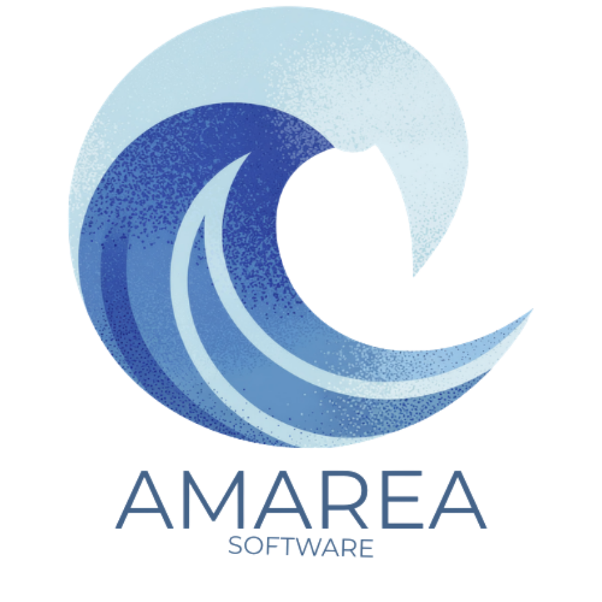

<font size="6"><b>AMAREA SOFTWARE</b></font>

### Sistema de Registro y Coordinación de Centros de Acopio

**AMAREA SOFTWARE** es una plataforma web desarrollada por el equipo **fsociety** para la trazabilidad de donaciones, control de inventario en tiempo real y coordinación logística estratégica de centros de acopio ante situaciones de emergencia, contingencias naturales y campañas humanitarias.

[](https://proyecto-hackaton-fsociety.onrender.com/)
[](https://www.oracle.com/java/)
[](https://spring.io/)
[](https://tidbcloud.com/)
[](https://github.com/Mauh28/proyecto_hackaton_fsociety)

<br clear="left"/>
<br/>

## 🌐 Acceso a la Aplicación (Despliegue en Vivo)

Puedes acceder a la versión desplegada en producción directamente a través del siguiente enlace:

👉 **[https://proyecto-hackaton-fsociety.onrender.com/](https://proyecto-hackaton-fsociety.onrender.com/)**

---

## 🛠️ Herramientas y Stack Tecnológico (Resumen)

* **Backend:** Java 17 & Spring Boot 4.1.1 (Arquitectura REST, Spring Data JPA, Hibernate).
* **Base de Datos:** TiDB Cloud Serverless (MySQL distribuido de alta disponibilidad 24/7 en la nube).
* **Frontend:** HTML5, CSS3 y JavaScript vanilla modular (interfaces responsivas para Voluntarios, Encargados y Coordinación).
* **Despliegue & DevOps:** Render Cloud Platform, Git & GitHub.
* **Asistencia Técnica:** Antigravity IDE (Gemini 3.8 Flash).

> ℹ️ *El desglose exhaustivo de la arquitectura técnica, modelo de datos y diseño operativo se presenta a detalle en la presentación oficial que acompaña este proyecto.*

---

## 🤖 Declaración de Uso de Herramientas de IA

* **Herramienta:** **Antigravity IDE** con el modelo **Gemini 3.8 Flash**.
* **Propósito:** Apoyo técnico en diseño de arquitectura, depuración de código y saneamiento de servicios. La formulación del problema, la lógica de negocio y las validaciones del sistema son dirigidas por el equipo.

---

## 💻 Instrucciones de Instalación y Ejecución Local

### 1. Clonar el Repositorio
```bash
git clone https://github.com/Mauh28/proyecto_hackaton_fsociety.git
cd proyecto_hackaton_fsociety
```

### 2. Compilar y Ejecutar
La conexión a TiDB Cloud ya se encuentra preconfigurada en `src/main/resources/application.properties`.

* **En Windows (PowerShell / CMD):**
  ```powershell
  .\mvnw.cmd spring-boot:run
  ```

* **En Linux / macOS:**
  ```bash
  ./mvnw spring-boot:run
  ```

### 3. Acceder en Local
Una vez iniciado el servidor, abre tu navegador en:  
👉 **[http://localhost:8080](http://localhost:8080)**
